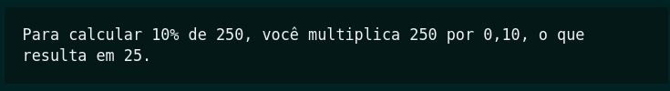
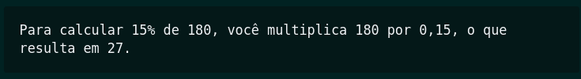
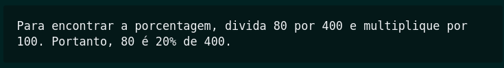
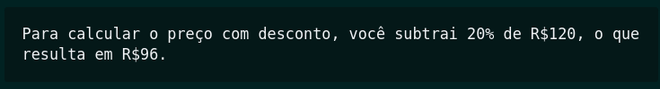
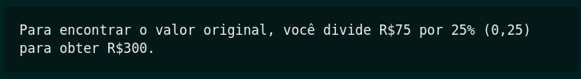
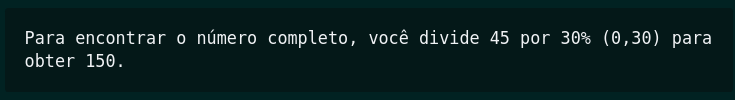
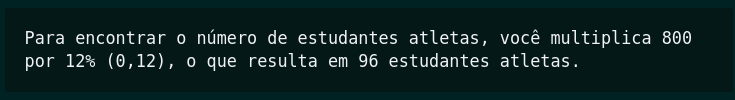
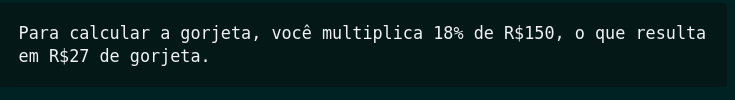
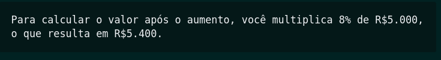
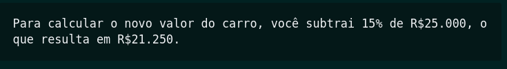

# Porcentagem

As porcentagens podem ser escritas na forma decimal. Por cento significa por 100. Então, dividimos a porcentagem por 100 para obter um número decimal equivalente. Em seguida, removemos o sinal de porcentagem (%). Por exemplo, 65% pode ser convertido para a forma decimal ao resolvermos 65÷100. Então, 65%=0,65. Outra forma de entender a divisão por 100 é mover a vírgula duas casas para a esquerda.

[Assista ao vídeo](assets/convertendo.mp4)

Este método é eficaz para cálculos rápidos e pode ser especialmente útil quando você precisa encontrar uma porcentagem de um número sem a necessidade de criar uma proporção.

---------------------------------------------------

## Exercícios (Só cálculo):


<details>
<summary> Calcule 10% de 250.</summary>

</details>
<br>
<details>
<summary>Encontre 15% de 180.</summary>

</details>
<br>
<details>
<summary>Qual é a porcentagem de 80 em relação a 400?</summary>

</details>
<br>
<details>
<summary>Se você tem um desconto de 20% em um produto de R$120, qual é o preço final?</summary>

</details>
<br>
<details>
<summary>Se você economizou R$75,00 com um desconto de 25% em uma compra, qual era o valor original?</summary>

</details>
<br>
<details>
<summary>Se 30% de um número é igual a 45, qual é o número completo?</summary>

</details>
<br>
<details>
<summary>Se 12% dos estudantes de uma escola são atletas, quantos estudantes em um total de 800 são atletas?</summary>

</details>
<br>
<details>
<summary>Você quer dar uma gorjeta de 18% em um restaurante onde a conta é R$150. Quanto você deve deixar de gorjeta?</summary>

</details>
<br>
<details>
<summary>Suponha que um investimento tenha aumentado em 8% durante o ano. Se o investimento inicial era de R$5.000, qual é o valor após o aumento?</summary>

</details>
<br>
<details>
<summary>Se você comprou um carro por R$25.000 e ele desvalorizou 15%, qual é o novo valor do carro?</summary>

</details>
<br>

------------------------------------------------------------------

## Exercícios (JAVA):

1. **Aumento de Salário:**
   Escreva um programa que solicite o salário de um funcionário e aplique um aumento de 10%. Exiba o novo salário.
<br>

2. **Desconto em Produto:**
   Crie um programa que peça o preço de um produto e aplique um desconto de 15%. Exiba o preço final.
<br>

3. **Calculadora de Notas:**
   Faça um programa que calcule a nota final de um aluno com base em três notas. A primeira nota tem peso 30%, a segunda 40% e a terceira 30%. Exiba a média e a situação do aluno (Aprovado se a média for maior ou igual a 7, Reprovado caso contrário).
<br>

4. **Reajuste de Preço:**
   Crie um programa que leia o preço de um produto e o tipo de reajuste desejado (em porcentagem). Aplique o reajuste e exiba o novo preço.
<br>

5. **Compra Parcelada:**
   Solicite o valor de uma compra e o número de parcelas desejado. Se o número de parcelas for maior que 6, aplique um juro de 5% sobre o valor total. Exiba o valor total a ser pago.
<br>

6. **Desconto Progressivo:**
   Crie um programa que leia o preço de um produto. Se o preço for maior que R$100, aplique um desconto de 10%. Se for maior que R$200, aplique 20% de desconto. Caso contrário, mantenha o preço original.
<br>

7. **Comissão de Vendas:**
   Peça ao vendedor o valor total de suas vendas no mês. Se o valor for maior que R$10.000, calcule uma comissão de 5% sobre as vendas. Exiba a comissão a ser recebida.
<br>

8. **Desconto para Idosos:**
   Peça a idade de uma pessoa e o preço de um produto. Se a pessoa tiver mais de 60 anos, aplique um desconto de 20%. Caso contrário, mantenha o preço original.
<br>

9. **Cálculo de Imposto:**
   Solicite ao usuário um valor e calcule o imposto a ser pago. Se o valor for maior que R$1.000, aplique uma taxa de imposto de 15%. Caso contrário, isente-o de imposto.
<br>

10.  **Custo de Entrega:**
    Peça o valor total de uma compra e calcule o custo de entrega com base na seguinte tabela: para compras até R$100, o custo de entrega é de 10% do valor total; para compras entre R$100 e R$200, o custo é de 5% do valor total; para compras acima de R$200, a entrega é gratuita. Exiba o custo de entrega.
<br>

--------------------------------------------------------------

## Exercício Bônus!!
<div align="center" >

</div>

--------------------------------------------------------------


**Calculadora de Descontos em Compras Dependentes:**

Crie um programa que permita ao usuário realizar uma compra em uma loja virtual. O programa deve solicitar o valor total da compra e, com base nesse valor, aplicar descontos dependentes de várias condições:

1. Se o valor da compra for maior ou igual a R$100, aplique um desconto de 10%.
2. Se o valor da compra for maior ou igual a R$200, aplique um desconto adicional de 5% sobre o valor com o desconto já aplicado no passo 1.
3. Se o valor da compra for maior ou igual a R$300, aplique um desconto extra de 3% sobre o valor com os descontos aplicados nos passos 1 e 2.

Além disso:

- Adicione um frete de R$ 25,00.
- Ofereça frete grátis se o valor da compra for superior a R$250 (após aplicar todos os descontos).

Retorno desejado (exemplo):
```
Valor da compra: R$ 350,00
Valor com desconto: R$ 290,27
Valor do frete: R$ 0,00
Total a pagar: R$ 290,27 
```
